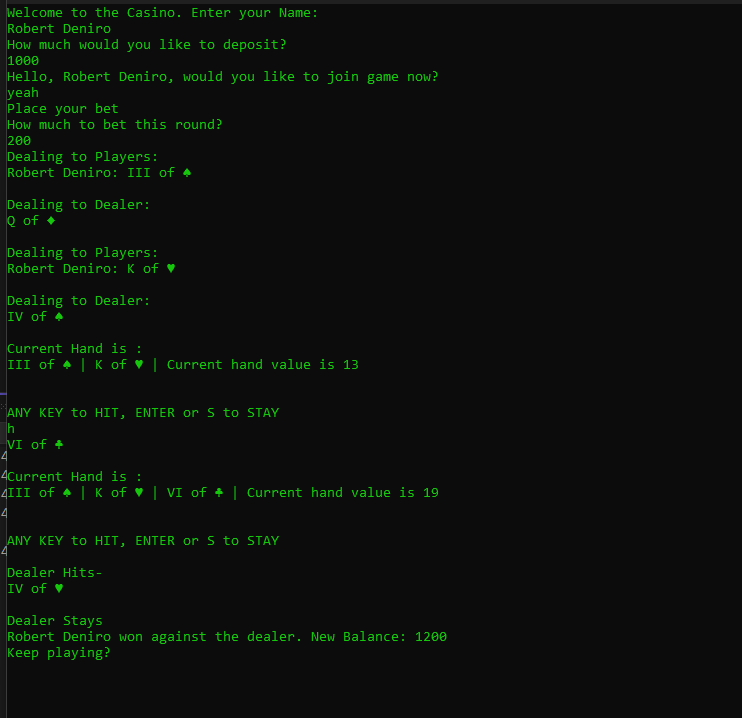

# C# Console Apps

Simple Applications that run via the Console, without a GUI. Built using Visual Studio.

## Projects

### [TwentyOne Game]()

Play a simple game of 21. Utilizes most of the basic concepts of C# development including error handling, enumerated variables, and inherited classes. Also implements symbols in an attempt at the aesthetic.



### [Scores App]()

A group of test scores are read and averaged. Demonstrates reading lines from a file, converting the data into usable data and performing a calculation on it.


```bash
<html>
  <p>Hello Universe!</p>
</html>